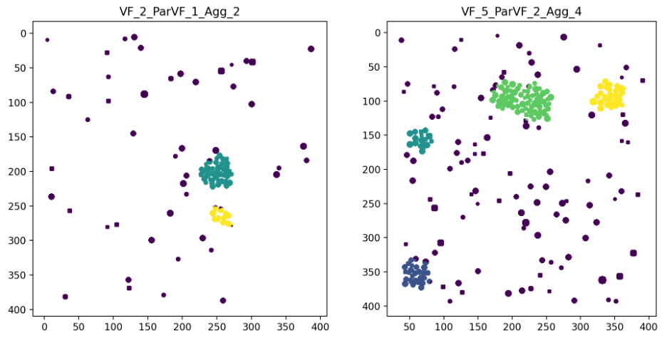
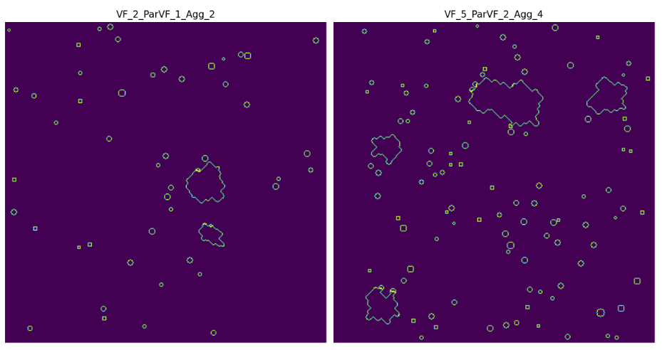
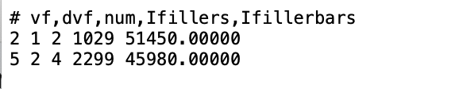

# descriptor-calculation
1. identify the spatial locations of each agglomerate while allowing for the presence of dispersed particles, and
2. Calculate a descriptor, Ifiller, that describe the system

Naming: VF_2_ParVF_1_Agg_2 indicates a particle volume fraction of 2%, a dispersed (non-clustered) particle volume fraction of 1%, and two agglomerations.

# Core Functionality --- cluster_w_noise.py

The script aims to identify the spatial locations of each agglomerate while allowing for the presence of dispersed particles, consistent with the system information encoded in the naming convention.

This script performs automated clustering of particle distributions using DBSCAN with periodic boundary conditions. It reads binary particle masks from .mat files, converts them into particle coordinates, and applies a grid search over DBSCAN parameters to identify clustering results that match a prescribed number of clusters while satisfying a volume-fraction–based consistency criterion. For each sample, clustering labels are saved to disk, a global summary table of parameters used is saved, and selected results are visualized together after all samples have been processed. The saved ‘cluster_label.txt’ is further used to calculate descriptors of the system.

These are two examples of clustering result:

# Core Functionality --- Ifiller.py

This script post-processes DBSCAN clustering results to quantify and visualize particle–matrix interfacial boundaries in systems containing both agglomerated and dispersed particles. It reads precomputed cluster_label.txt files together with the original binary particle masks stored in .mat format, reconstructs cluster-wise and dispersed-particle masks, and identifies interfacial boundary pixels using morphological operations. A key idea is to remove interior regions of particle agglomerates, which do not interact with the surrounding matrix, and retain only the outer boundaries that represent physically meaningful particle–matrix interfaces.

The extracted boundary pixels characterize the exposure of particles or particle clusters to the matrix phase. Their total contribution is defined as I-filler, which intuitively corresponds to the amount of boundary pixels highlighted in each system and is strongly correlated with bulk material properties. For each sample, I-filler and its normalized form (I-filler bars) are computed and saved to a summary file, while selected samples are visualized after all processing is complete. The script is designed as a lightweight analysis step that builds directly on existing clustering outputs, with I-filler serving as an important descriptor of the material system.

The following figure shows two boundary-identification results obtained from the same two example systems shown above.

And their I-filler results are saved as:

